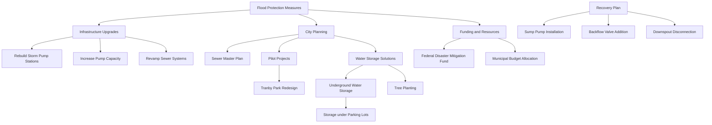

# disaster_recovery_plan
DRP for lab 4
Version: 1.1

Design an intuitive, user-friendly security portal:

```markdown
┌─────────────────────────────────────────────────────────┐
│              DISASTER COMMUNICATION PORTAL              │
├───────────────┬───────────────────┬─────────────────────┤
│ EMERGENCY     │ COMMUNICATION     │ ALERTS & UPDATES    │
│ PROCEDURES    │ CHANNELS          │                     │
├───────────────┼───────────────────┼─────────────────────┤
│ • Server      │ • Internal Comms  │ • Current Threats   │
│   Failover    │ • Customer Alerts │ • System Status     │
│ • Data Backup │ • Regulatory      │ • Branch Updates    │
│ • Evacuation  │   Reporting       │                     │
├───────────────┼───────────────────┼─────────────────────┤
│ REPORT AN     │ RECOVERY TOOLS    │ EMERGENCY CONTACTS  │
│ INCIDENT      │                   │                     │
└───────────────┴───────────────────┴─────────────────────┘
```

```markdown
┌─────────────────────────────────────────────────────────┐
│              FLOOD DISASTER RESPONSE PORTAL             │
├───────────────┬───────────────────┬─────────────────────┤
│ FLOOD         │ COMMUNICATION     │ ALERTS & UPDATES    │
│ PROCEDURES    │ CHANNELS          │                     │
├───────────────┼───────────────────┼─────────────────────┤
│ • Pump        │ • Staff Emergency │ • Flood Warnings    │
│   Activation  │   Notifications   │ • Water Levels      │
│ • Data Center │ • Customer Alerts │ • Branch Closures   │
│   Protection  │ • Local Authority │ • Road Conditions   │
│ • Evacuation  │   Coordination    │                     │
├───────────────┼───────────────────┼─────────────────────┤
│ REPORT        │ FLOOD MITIGATION  │ EMERGENCY CONTACTS  │
│ FLOODING      │ RESOURCES         │                     │
└───────────────┴───────────────────┴─────────────────────┘
```


# Disaster Communication Plan for Bank



## 1. Identify Potential Disasters and Impacts

- [ ] Natural disasters (e.g., floods, hurricanes, earthquakes)
- [ ] Power outages
- [ ] Cyber attacks
- [ ] Physical security breaches
- [ ] Pandemic or health crises

Assess potential impacts on:
- Customer services
- On-premises servers
- Phone systems
- ATM networks
- Online banking platforms

## 2. Establish Communication Hierarchy

- [ ] Board of Directors
- [ ] Executive Management
- [ ] IT Department
- [ ] Customer Service Representatives
- [ ] Branch Managers
- [ ] Security Team
- [ ] External Vendors and Partners

## 3. Internal Communication Methods

- [ ] Secure messaging system
- [ ] Company-wide email alerts
- [ ] Internal phone tree
- [ ] Emergency notification system
- [ ] Secure video conferencing platform

## 4. External Communication Channels

- [ ] Customer-facing website updates
- [ ] Social media platforms
- [ ] Email notifications to customers
- [ ] SMS alerts for registered customers
- [ ] Local media outlets for broader announcements

## 5. Technical Infrastructure Continuity

- [ ] Server failover procedures
- [ ] Data backup and recovery protocols
- [ ] Alternative power sources (generators)
- [ ] Remote access capabilities for critical staff
- [ ] Redundant internet connections

## 6. Phone System Contingencies

- [ ] Cloud-based backup for on-premises phone system
- [ ] Mobile phone distribution to key personnel
- [ ] Call forwarding procedures to operational locations
- [ ] Updated IVR messages for customer information

## 7. Regulatory Compliance and Reporting

- [ ] Procedures for notifying regulatory bodies
- [ ] Documentation protocols for incident reporting
- [ ] Customer data protection measures
- [ ] Financial transaction continuity plans

## 8. Customer Service Continuity

- [ ] Scripts for customer service representatives
- [ ] FAQ updates for common customer concerns
- [ ] Alternative transaction processing methods
- [ ] Procedures for handling time-sensitive operations (e.g., wire transfers, loan payments)

## 9. Emergency Response Team

- [ ] Define roles and responsibilities
- [ ] Establish chain of command
- [ ] Create contact list with multiple contact methods
- [ ] Designate alternates for each key role

## 10. Testing and Training

- [ ] Regular drills for various disaster scenarios
- [ ] Annual review and update of the communication plan
- [ ] Cross-training staff on critical communication procedures
- [ ] Simulations of server and phone system failures

## 11. Post-Incident Analysis

- [ ] Procedures for assessing communication effectiveness
- [ ] Methods for gathering feedback from staff and customers
- [ ] Process for incorporating lessons learned into the plan

---

**Note:** This plan should be regularly reviewed, updated, and integrated with the overall business continuity and disaster recovery strategies of the bank.
